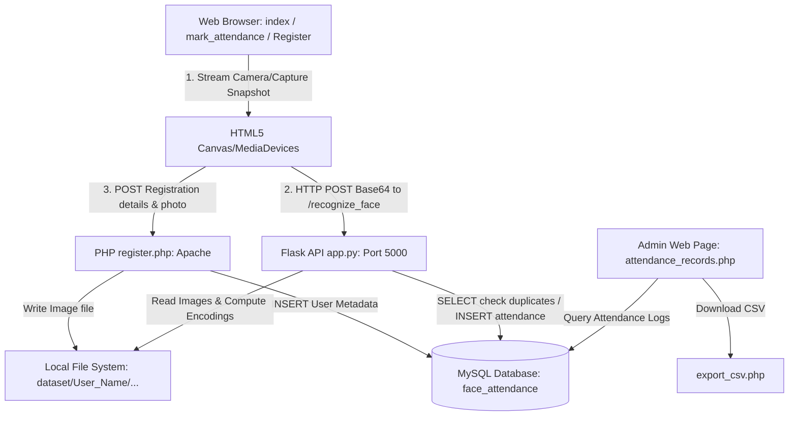

# SMART LMS — Face Recognition Attendance System
> A hybrid web application that marks user attendance by capturing face snapshots via browser camera APIs and identifying them using a local Python/Flask face recognition microservice.
---
## 📊 Project Metadata
* **Development Duration:** July 2025 (Approx. 2 days based on repository git history)
* **Tech Stack:**
  * **Frontend:** HTML5, JavaScript (Fetch API, HTML5 Canvas, MediaDevices API), CSS3 (Bootstrap 5, customized Glassmorphism, neon keyframe animations)
  * **Backend Services:** 
    * Python (Flask 3.x, CORS, raw `base64` image stream decoding)
    * PHP (Apache handler, File System operations, MySQL transactional wrapper)
  * **Computer Vision / ML:** Python `face_recognition` library (dlib HOG face detector & 128-d face embedding generator), `numpy`
  * **Database:** MySQL/MariaDB (Python `mysql-connector-python` and PHP `mysqli`)
  * **Reporting:** CSV (PHP native streaming)
---
## 🔍 Project Overview
This repository contains a prototype **Face Recognition Attendance System** designed to automate attendance logging. It is built as a hybrid system that bridges browser-based web pages with a local Python AI microservice and a PHP data storage server.
The project exists to solve the inefficiencies and fraud issues (like "buddy punching") found in traditional attendance methods (paper sheets, barcode scans, card swipes) by utilizing face tracking to confirm presence.
---
## 🏆 Key Milestone & Achievement
* **Functional Hybrid Prototype**: Successfully integrated three separate runtimes (Browser JavaScript, PHP Apache server, and Python Flask microservice) into a unified workflow.
* **Vercel Web Shell Deployment**: Deployed a functional static frontend/demo page to Vercel for layout visualization.
* *Note on academic/commercial status*: This project is a solo developer portfolio/academic prototype; no external patents, IEEE publications, or conference presentations are associated with this repository.
---
## 👥 Leadership & Responsibilities
As a solo project, all developmental and architect roles were performed by the author:
* **System Design**: Designed a decoupled system consisting of a client browser, a PHP script handling registrations/views, and a Python Flask backend executing neural-network face checks.
* **Database Design**: Structured a two-table relational MySQL schema (`users` and `attendance`) mapping faces, registration details, and timestamped logs.
* **Frontend Development**: Created a glassmorphism theme using Bootstrap 5, implemented webcam media capture using HTML5 Canvas, and integrated API communication using the Fetch API.
* **Backend Development**: Implemented Python-based face detection and distance metric comparisons (`face_recognition` library), coupled with PHP data handlers and CSV exporters.
* **Testing & Deployment**: Developed test datasets (e.g. Narendra Modi, Vladimir Putin, and personal testing) to verify recognition accuracy and tolerance levels.
---
## ⚠️ Problem Statement
* **Time Inefficiency**: Manual roll calls consume productive work or class time, especially in large groups.
* **Vulnerability to Proxy Attendance**: Card-swiping, pin numbers, and paper sheets can easily be shared, allowing students or employees to mark attendance for absent peers.
* **Administrative Overhead**: Transitioning manual sign-in logs to digital databases requires repetitive transcription work and is prone to human error.
* **Camera Access Web Integration**: Python face-recognition packages are typically designed as local desktop applications. Establishing a link between standard browser-based webcam interfaces and local AI model runtimes requires a custom bridge API.
---
## 💡 Solution Implemented
* A responsive web shell using the HTML5 **MediaDevices API** (`getUserMedia`) to stream real-time video feed and capture JPEG frames as base64 data URLs.
* A local Python Flask microservice that serves a `/recognize_face` POST endpoint. It decodes base64 image requests, runs facial detection/comparison, and executes query updates on MySQL.
* A PHP administration module for viewing logged attendance, searching entries dynamically by date/name, and exporting reports in CSV format.
---
## ⚙️ Key Features
### 👤 [AUTHENTICATION / USER REGISTRATION]
* **Feature:** Camera-assisted user profile creation ([Register.html](Register.html), [register.php](register.php)).
* **Capability:** Captures user profile fields (Name, Email, Phone, Address) along with a raw webcam snapshot. The PHP script writes the image to `dataset/<name>/` and records user paths to the database.
* **Benefit:** Ensures user reference images are organized and cataloged under distinct folder locations for scanning.
### 🎥 [REAL-TIME FACE TRACKING & RECOGNITION]
* **Feature:** Webcam-capture recognition microservice ([mark_attendance.html](mark_attendance.html), [app.py](app.py)).
* **Capability:** Provides live video preview boxes decorated with glowing neon indicators, captures the frame, and posts it to Flask. The Flask endpoint compares the face embedding against preloaded datasets at a strict `0.5` tolerance threshold.
* **Benefit:** Fast, automated recognition that prevents unauthorized logs.
### 🔒 [ATTENDANCE LOGGING & DUPLICATE PREVENTION]
* **Feature:** Transactional day-boundary constraint check in `app.py`.
* **Capability:** Prior to writing an attendance entry, the system issues a check query (`SELECT COUNT(*) FROM attendance WHERE name=%s AND date=CURDATE()`). If already marked, it blocks new inserts.
* **Benefit:** Eliminates database bloat and duplicate logs for a single user on the same calendar day.
### 📋 [ATTENDANCE RECORDS BOARD]
* **Feature:** Administrator log explorer and report builder ([attendance_records.php](attendance_records.php)).
* **Capability:** Displays paginated records, filters entries on-the-fly by name/date via AJAX, and redirects parameters to [export_csv.php](export_csv.php) for a direct CSV download.
* **Benefit:** Simplifies administrative audit processes and provides offline storage of attendance logs.
---
## 🏗️ System Architecture

---
## 🗄️ Database Concepts Applied
* **Relational Schema Separation**: Divided data structures into two tables: `users` (containing metadata: contact info and image files paths) and `attendance` (containing transactional timestamp logs).
* **Auto-Increment Primary Keying**: Implemented auto-incrementing integers (`id`) to uniquely index user profiles.
* **Duplicate Log Filtering**: Employed SQL transactional conditions at the query layer to validate date constraints (`CURDATE()`) preventing redundancy.
* **Data Sanitization**: Escaped parameters using PHP `real_escape_string` and used parameterized queries (`bind_param` and Python cursor execution) to guard against SQL injection.
---
## 🛠️ Challenges Faced & Technical Solutions
### [CHALLENGE-01] Face Data Synchronization Latency
* **Problem:** In `app.py`, the facial encodings database is loaded into Python server memory *only once during application startup*. If a new student registers their profile via the PHP web page, the image file is successfully stored in `dataset/`, but the running Python Flask process remains unaware of it. The system will fail to recognize the new student ("Unknown") until the Flask server is manually restarted.
* **Solution:** Modify `app.py` to support dynamic cache invalidation (e.g. reload dataset encodings if a face is not matched by scanning the file system, or expose a `/reload_dataset` route triggered automatically by PHP after a registration is saved).
### [CHALLENGE-02] Hardcoded Platform-Dependent File Paths
* **Problem:** In `app.py`, the dataset scanning path is hardcoded to a Windows directory `"D:\\xampp\\htdocs\\project\\dataset"`. This causes immediate application failure if the project is run on another drive letter, root folder name, or deployed to a UNIX/Linux environment.
* **Solution:** Replace absolute directories with a relative path resolving system based on the execution path: `os.path.join(os.path.dirname(__file__), 'dataset')`.
### [CHALLENGE-03] Decoupled Write Clients (Dual Backends)
* **Problem:** Database write operations are divided across two completely separate programming environments: PHP handles user registration, while Python handles attendance insertions. This increases database credentials management complexity and raises structural sync concerns.
* **Solution:** Consolidate registration logic into Python Flask by migrating image decoding and file-saving operations from PHP to Flask endpoints. This allows the PHP layer to remain purely transactional/view-oriented or be removed entirely in favor of a Python-only application.
---
## 📈 Results & Impact
* **Automated Check-ins**: Replaces manual sign-ins, reducing class or workspace check-in overhead to a 2-second webcam glance.
* **Buddy Punching Prevention**: Uses direct facial feature scanning, preventing users from proxy-marking absent colleagues.
* **Export Capability**: Speeds up record extraction with administrative dashboard filtering and one-click CSV creation.
---
## 🚀 Future Scope
* **Unified API Backend**: Deprecate PHP entirely and move views/data transactions to Python Flask, consolidating the system to a single stack.
* **Dynamic Dataset Reloading**: Reload new facial encodings dynamically upon user registration.
* **Anti-Spoofing / Liveness Check**: Integrate blink-detection or head-movement checks to prevent users from marking attendance using printed photos or mobile screens.
* **Normalized Database Schema**: Relate tables using `user_id` instead of comparing string names, avoiding registration conflicts for individuals sharing identical names.
---
## 🔗 Project Links & Live Demo
* **Live Demo Web Interface**: [Vercel Deployment](https://ai-powered-face-tracking-attendance-system-di6t0yza7.vercel.app?_vercel_share=ea078STgoxikEp2CCCY0SO5T2Z5VOpdk)
* **Source Repository**: [GitHub Repository](https://github.com/sathyaseelan2006/AI-powered-face-tracking-attendance-system)
