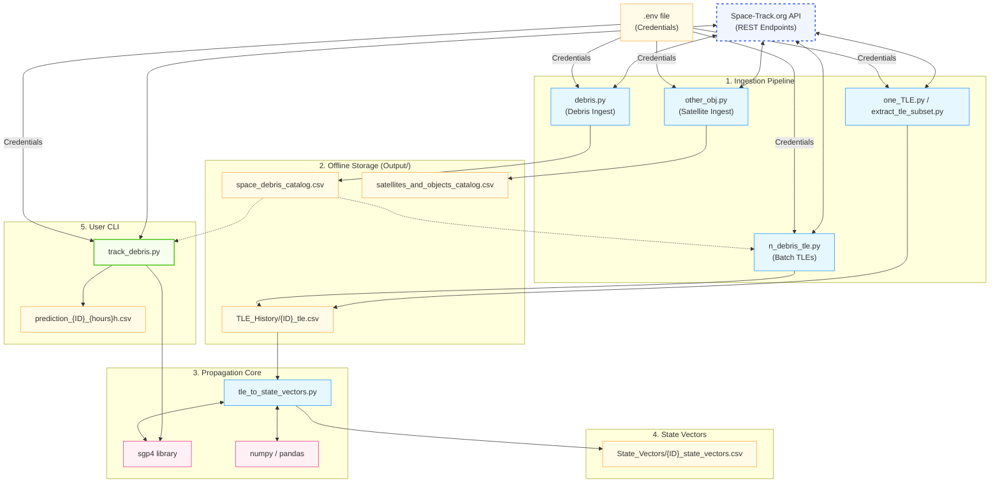

# 🛰️ Space Debris Risk Prediction

A Python-based orbital mechanics and propagation system to track space debris, retrieve historical Two-Line Element (TLE) datasets, and compute 3D Cartesian state vectors using the SGP4 algorithm.

---

## 📅 Project Metadata
* **Duration**: June 2026 (Active development)
* **Role**: Solo Developer (System Design, API Integration, CLI Tool, and Data Engineering)

---

## 💻 Tech Stack
* **Programming Language**: Python 3.7+
* **API Access**: SpaceTrackClient (`spacetrack` Python library)
* **Orbital Mechanics**: SGP4 Propagation (`sgp4` Python library)
* **Data Engineering**: Pandas (data cleaning, structure, formatting), NumPy (vector computations)
* **Environment Management**: `python-dotenv`
* **Storage**: CSV (Tabular file-based database format)

---

## 📋 Project Overview
### What it is
The **Space Debris Risk Prediction** system is a collection of Python data pipelines and an interactive command-line interface (CLI) that interfaces with the US Space Command's database (via [Space-Track.org](https://www.space-track.org/)). It retrieves catalog metadata for space objects, downloads historical orbital epochs, and propagates them to calculate physical coordinates and velocity vectors over time.

### Why it exists
Earth's orbit contains tens of thousands of debris pieces (defunct satellites, spent rocket stages, fragments). Spacecraft and active satellites must constantly run risk assessments against cataloged debris to perform avoidance maneuvers. This system bridges the gap between text-based satellite element tracking formats (TLEs) and clean numerical data frames suitable for collision warning systems, trajectory modeling, and machine learning research.

### What problem it solves
* **Raw Format Complexity**: Raw TLE data is hard to parse and mathematically propagate without specialized orbital mechanics tooling.
* **API Ingestion Bottlenecks**: Space-Track.org enforces strict query quotas. Batch downloads will get blocked if not rate-throttled.
* **Data Transformation Overhead**: Standardizing coordinate conversions, time formats, and handling propagation errors requires significant engineering setup.

---

## 🏆 Key Milestone & Achievement
* **End-to-End Propagation Pipeline**: Successfully built and tested a data workflow that queries the satellite catalog, retrieves chronological TLE datasets, and generates high-fidelity $(x, y, z)$ position and velocity files.
* **Unified CLI Utility**: Built `track_debris.py` which exposes real-time lookups, keyword searches, and future trajectory predictions directly in the terminal.
* **Error-Resilient SGP4 Execution**: Implemented custom checks for decaying or unstable orbits, preventing SGP4 engine calculation errors from halting bulk runs.

---

## 👤 Leadership & Responsibilities
As this is a solo project, all development and engineering stages were managed individually:
* **System Design**: Designed the modular script architecture linking SATCAT extraction to the TLE historian and Cartesian vector solver.
* **API Integration**: Integrated `SpaceTrackClient` and structured queries with custom filters for active/inactive objects and target classes.
* **CLI Development**: Programmed an argparse-based CLI utility supporting real-time position reporting, catalog search, and trajectory forecasts.
* **Data Engineering**: Cleaned incoming API payloads (which return values as string types), filtered out duplicate epochs, and computed distance, altitude, and velocities using Pandas and NumPy.
* **Data Management**: Defined local persistence strategies for tracking directories (`Output/`, `Output/TLE_History/`, `Output/State_Vectors/`).

---

## ⚠️ Problem Statement
* **Lack of Numerical Coordinates**: The standard tracking output for space objects is the Two-Line Element (TLE) ASCII format. Converting these strings into raw positions $(X, Y, Z)$ requires implementing SGP4 orbit models.
* **Quota Restrictions**: Space-Track accounts are limited to 20 requests per minute and 300 requests per hour. Developers attempting batch history pulls risk account locking or script execution failures.
* **Library Interface Overhead**: Running SGP4 calculations in Python requires converting calendar dates into Julian times, parsing raw string rows into class objects, and trapping orbital decay errors.
* **Debris Segmentation**: Navigating the database of ~35,000 active objects is complex without a filtering process that separates debris fragments from operational spacecraft.

---

## 🛠️ Solution Implemented
A modular pipeline of Python scripts designed to run sequentially or interactively:
1. **Catalog Acquisition (`debris.py` & `other_obj.py`)**: Queries and exports records (apogee, perigee, country, launch date, radar cross-section size) for tracked DEBRIS or PAYLOAD/ROCKET BODY objects into CSV format.
2. **Chronological TLE Harvester (`n_debris_tle.py`, `one_TLE.py`, & `extract_tle_subset.py`)**: Fetches historical arrays of TLEs for cataloged IDs, using sleep delays to respect API rules.
3. **Cartesian Vector Solver (`tle_to_state_vectors.py`)**: Converts raw TLE histories into coordinate timeseries ($x, y, z, v_x, v_y, v_z$ relative to Earth's center).
4. **Command-Line Interface Tool (`track_debris.py`)**: Terminal tool providing direct queries for live position tracking, path prediction, search filters, and object detail summaries.

---

## ✨ Key Features

### 📡 CATALOG INGESTION & FILTERING
* **Feature**: Automated SATCAT metadata queries.
* **Capability**: Filters and fetches entries based on object type (DEBRIS vs. PAYLOAD/ROCKET BODY) and status (currently tracked).
* **Benefit**: Allows users to quickly isolate physical objects of interest and identify high-risk fragments based on size and radar cross-section.

### ⏱️ TLE HISTORY ACQUISITION
* **Feature**: Throttled historical TLE downloader.
* **Capability**: Requests the full historical array of orbital states (epochs) for single or multiple catalog numbers, implementing sleep safety margins.
* **Benefit**: Ensures reliable data extraction without triggering API lockouts or credential suspensions.

### 🧮 SGP4 PROPAGATION ENGINE
* **Feature**: State-vector trajectory compiler.
* **Capability**: Converts chronological TLE records to Julian dates and propagates them to 3D Cartesian coordinates and velocities in a single pass.
* **Benefit**: Translates raw text elements into structured, continuous numerical timeseries ready for data analysis.

### 💻 REAL-TIME TRACKING & PREDICTION CLI
* **Feature**: Argparse-driven interactive terminal interface.
* **Capability**: Fetches the latest TLE on-demand and propagates coordinates to the exact present moment (calculating current altitude and speed) or projects future coordinates at set intervals.
* **Benefit**: Provides immediate situational awareness for specific objects (e.g., ISS or known debris clouds) without running complex script setups.

---

## 🏗️ System Architecture

---

## 📊 Database Concepts Applied
The system treats the local file hierarchy as a structured flat-file database using Pandas for join and query behaviors:
* **Relational Schema Normalization**:
  * **Static Dimensions Table (`space_debris_catalog.csv`)**: Holds descriptive object dimensions (launch dates, site, origin country, radar size, and period).
  * **Historical Fact Table (`[NORAD_ID]_tle.csv`)**: Time-series list containing the raw parameters indexed by timestamp (`EPOCH`).
  * **Propagated State Table (`[NORAD_ID]_state_vectors.csv`)**: Calculated numerical outcomes ($X, Y, Z, V_x, V_y, V_z$) associated with each epoch.
* **Primary Key Structuring**: The `NORAD_CAT_ID` functions as the primary key across catalogs, directory file-naming conventions, and lookup filters.
* **Deduplication & Validation**: Sanitizes data types (converting Space-Track string responses into floats) and drops duplicate epoch rows (`drop_duplicates()`) in TLE logs to maintain data consistency.

---

## 🔍 Challenges Faced

### `[CHALLENGE-01] Space-Track API Rate Limits`
* **Problem**: Downloading multi-year TLE arrays for multiple objects sequentially triggers Space-Track rate limits, causing API requests to be blocked or rejected with 429/403 status codes.
* **Solution**: Implemented a throttling mechanism using custom intervals (`SLEEP_SEC = 2`) inside `n_debris_tle.py` and wrapped API operations in robust try-except error handling blocks.

### `[CHALLENGE-02] Space-Track String Data Outputs`
* **Problem**: API JSON outputs return all orbital parameters (e.g. Inclination, Period, Apogee, Perigee, BSTAR) as strings, preventing immediate mathematical evaluation, filtering, or sorting.
* **Solution**: Developed sanitization scripts in `debris.py`, `one_TLE.py`, and `other_obj.py` that coerce specific string fields to floats using `pd.to_numeric(..., errors='coerce')`, ensuring malformed rows become `NaN` rather than triggering runtime crashes.

### `[CHALLENGE-03] SGP4 Code Propagation Faults`
* **Problem**: When propagating older debris elements or highly decayed orbits, the SGP4 compiler wrapper can throw errors (non-zero execution codes, such as out-of-bounds eccentricity), causing typical run loops to crash.
* **Solution**: Incorporated status checking (`error != 0`) post-propagation inside `tle_to_state_vectors.py`. Faulty epochs are discarded and skipped, preserving valid state calculations across the rest of the historical timeline.

---

## 📈 Results & Impact
* **Rapid Command-Line Lookup**: Operators can track any debris object, fetch its speed, altitude, and current Cartesian position, or predict its path for 24-48 hours within seconds.
* **Clean Research Pipelines**: Raw TLE data is converted to standardized CSV datasets ready for integration with Python packages like NumPy, Scikit-Learn, or Matplotlib.
* **Reduced Server Requests**: Storing downloaded data locally in `Output/` reduces repeat calls to the API, preserving user bandwidth and respecting server policies.

---

## 🚀 Future Scope
* **Collision Conjunction Detector**: Implement an automated tool to scan predicted orbits of active payloads against the debris catalog to identify close approach events (conjunctions).
* **Atmospheric Drag & Decay Forecasts**: Integrate historical decay trends (using BSTAR parameters in TLE history) to forecast terminal atmospheric re-entry windows.
* **3D Visualizer Dashboard**: Build an interactive web display (e.g. Streamlit + Plotly) to show real-time paths of tracked debris orbiting a 3D Earth model.

---

## 🔗 Project Links
* **Live Demo**: *Not applicable (Command-Line environment)*
* **GitHub Repository**: [Space-Debris-Risk-Prediction](https://github.com/sathyaseelan2006/space-debris-risk-prediction)
* **Research Paper**: *Not applicable*
* **Official Data Source**: [Space-Track.org API](https://www.space-track.org/)
